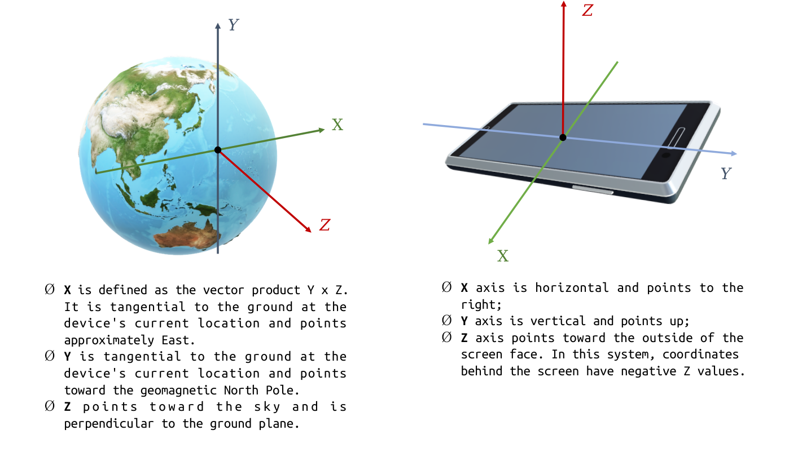
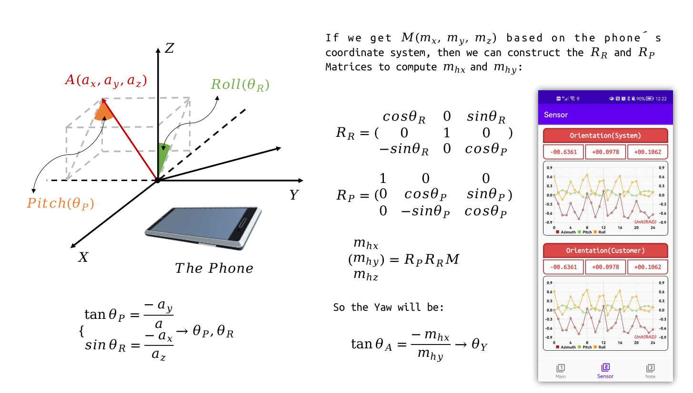
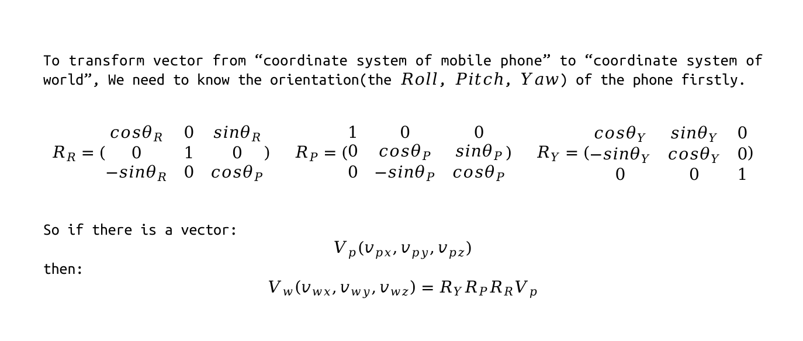
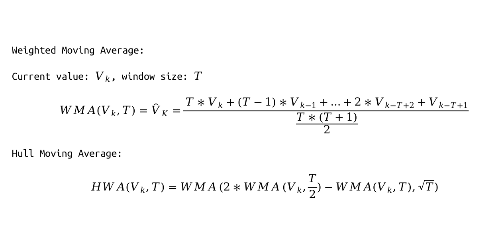
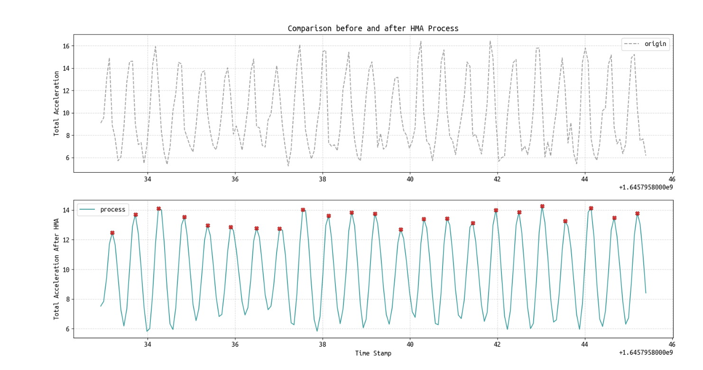
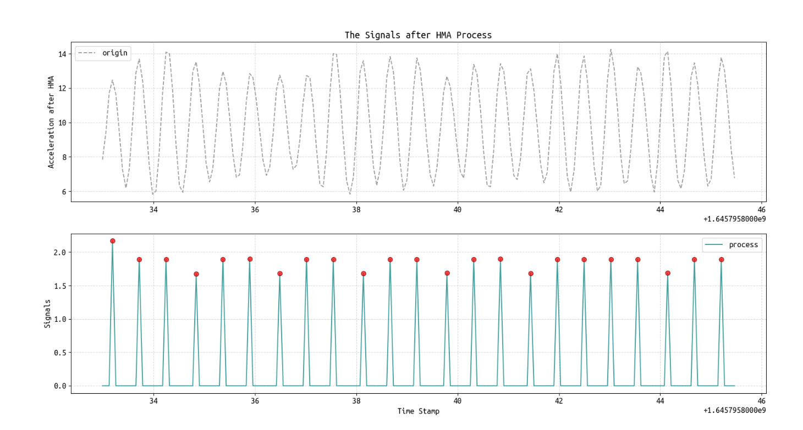
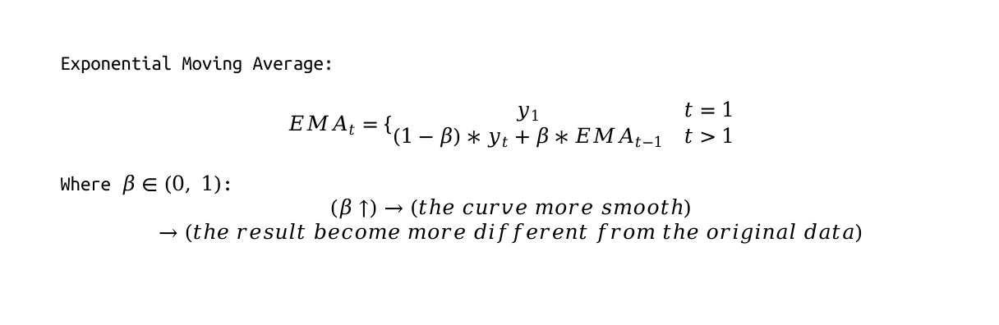
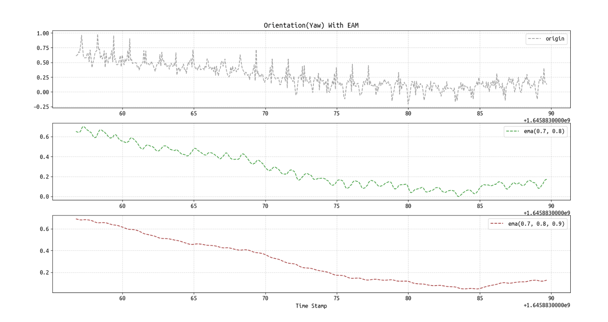
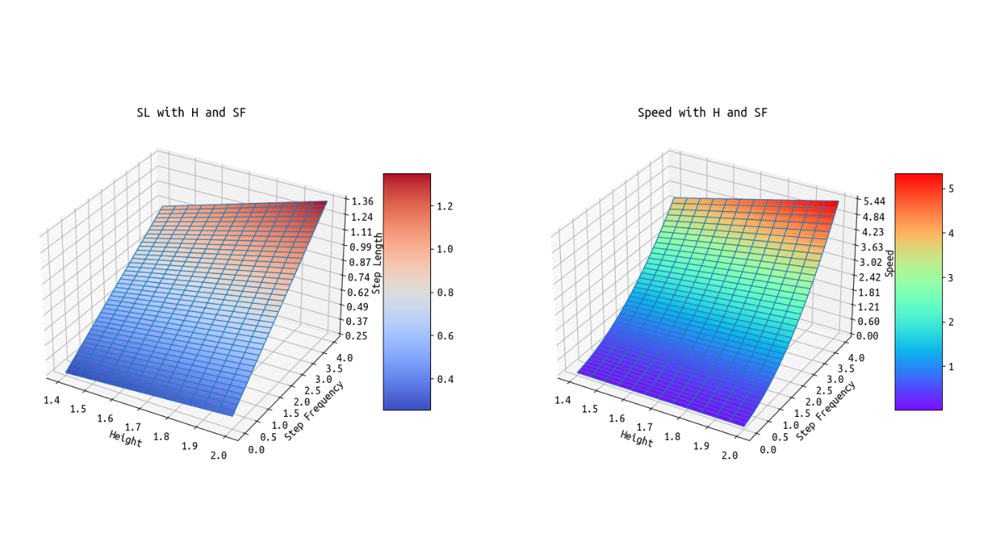
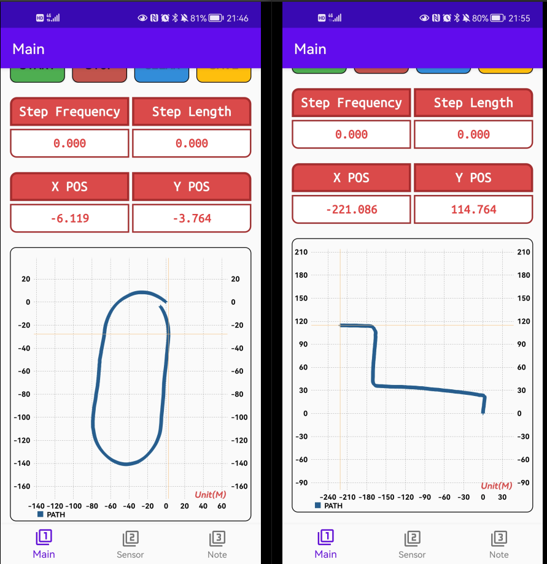

# Pedestrian Dead Reckoning

___Author: ShouLong Chen___

___School: WHU___

___E-Mail: 3079625093@qq.com___

[TOC]

## 1. OverView

PDR is a passive location method. It can obtain the pedestrian step frequency and step size according to sensors such as accelerometers, and then estimate the relative position of travelers according to the orientation.

Based on the Android operating system, this project uses Java as the development language and Android studio as the development platform to realize the PDR algorithm.

## 2. Main Parts

### 1. Coordinate system

### 2. Calculate azimuth

The calculation of azimuth mainly depends on the accelerometer and magnetometer inside the mobile phone:

### 3. Smoothing of acceleration

We use HMA algorithm for smoothing：

### 4. Azimuth smoothing

We use the EMA algorithm：

### 5. SF-SL Model

## 3. Result

