# A UWB Indoor Position System
>___Authors : csl lyq zy zyh wzr___   
>___E-Mail : 3079625093@qq.com___

## 1. ___OverView___
### UWB is ultra wideband, ultra wideband technology. It originated from the pulse communication technology rising in the 1960s. Ultra wideband (UWB) positioning technology uses anchor nodes and bridge nodes with known positions arranged in advance to communicate with newly added blind nodes, and uses TDOA positioning algorithm (students who do not know can click the above link to understand), so as to locate by measuring the transmission delay difference between different base stations and mobile terminals.  
---
## 2. libs
### The following is the library used by the UWB positioning algorithm framework:
## (1) ___Ceres___ 
### The C + + library developed by Google for solving nonlinear least squares problems is in this algorithm framework. Is used to provide relatively correct values for reference.

## (2) ___Point___ 
### Compact C + + template class for expressing two-dimensional or three-dimensional points. It is the basis of this algorithm framework, Used to express 3D point structure.

## (3) ___DurationTimer___ 
### Compact C + + template library for counting program running time. In this algorithm. It depends on the statistical time.

## (4) ___RapidJSON___ 
### The open source JSON parsing c + + library developed by Tengxun plans to introduce JSON into the current algorithm framework. Configure relevant information and use the library to parse.
---
## 3. ___File Structure___

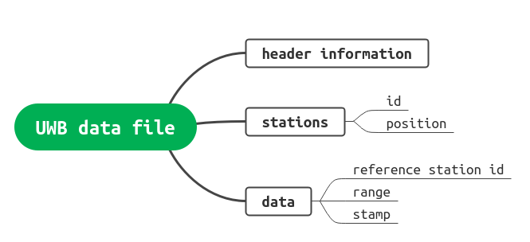  

### Note: the UWB file consists of three parts: header information (algorithm, version, equipment, etc.), base station, base station number and world coordinates), and multiple measured data items (each item has three parts: distance, reference base station and timestamp).

## 4. ___System Structure___

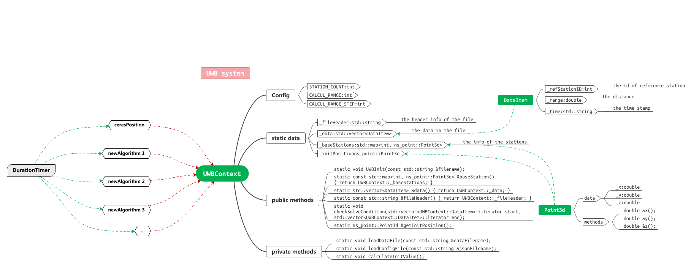   

### Note: the UWB system is controlled by a large static context class uwbcontext. It is a static class. It does not provide constructors to construct objects, but only methods to call. It consists of two parts.

## 5. Algorithms

>___STATIC_TEST___

### (1). ___Ceres___

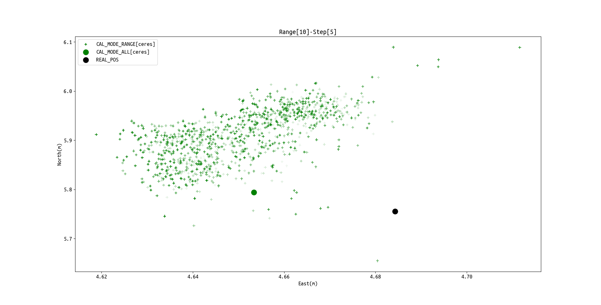   

### (2). ___NewtonLS___

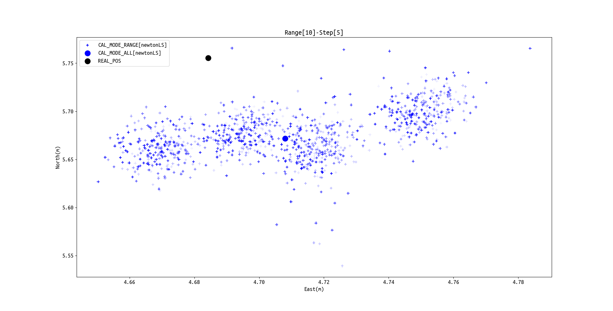 

### (3). ___taylorSeries___

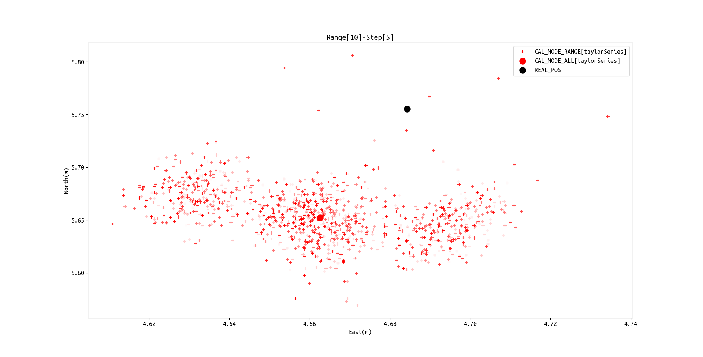 

### (4). ___linear___

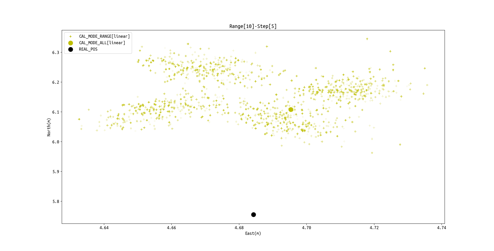 

### (5). ___linear___

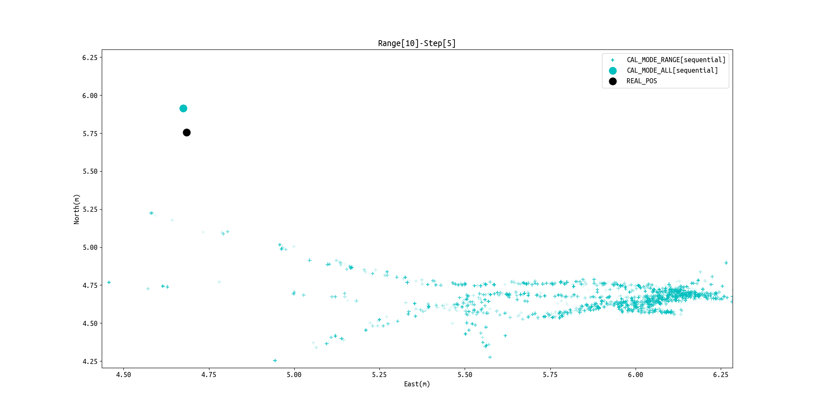 

### (6). ___algorithms___

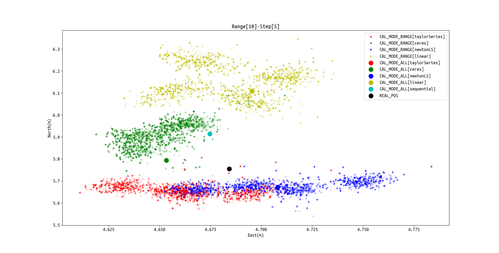 

>___STATIC___

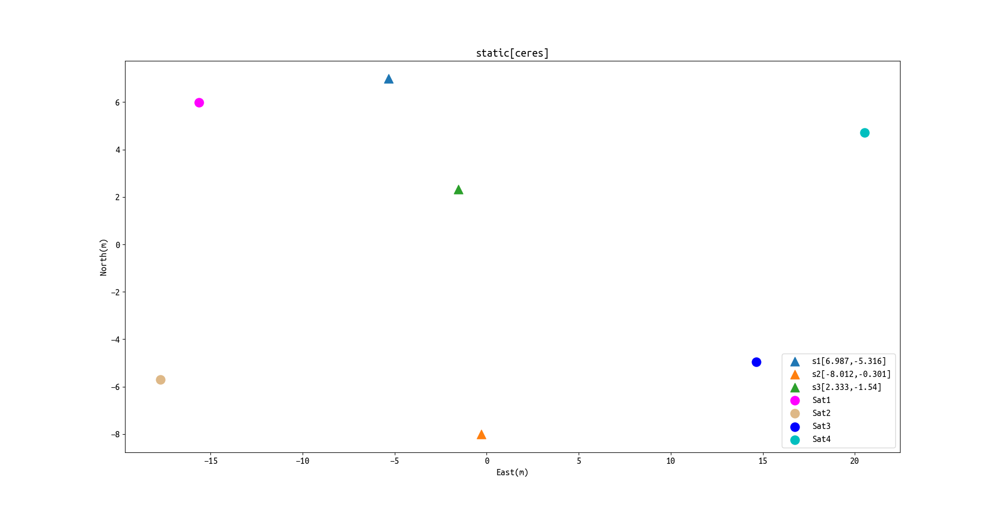

>___MOVE___  

### (1). ___move1___   

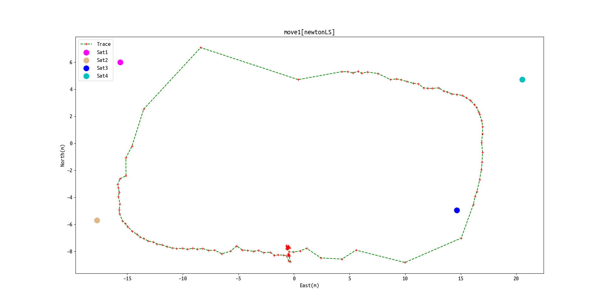 

### (2). ___move2___

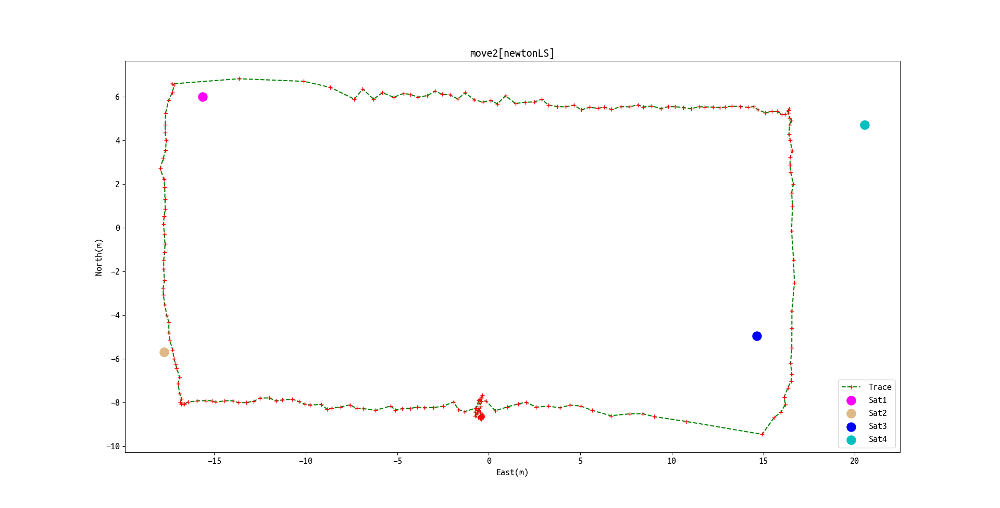 