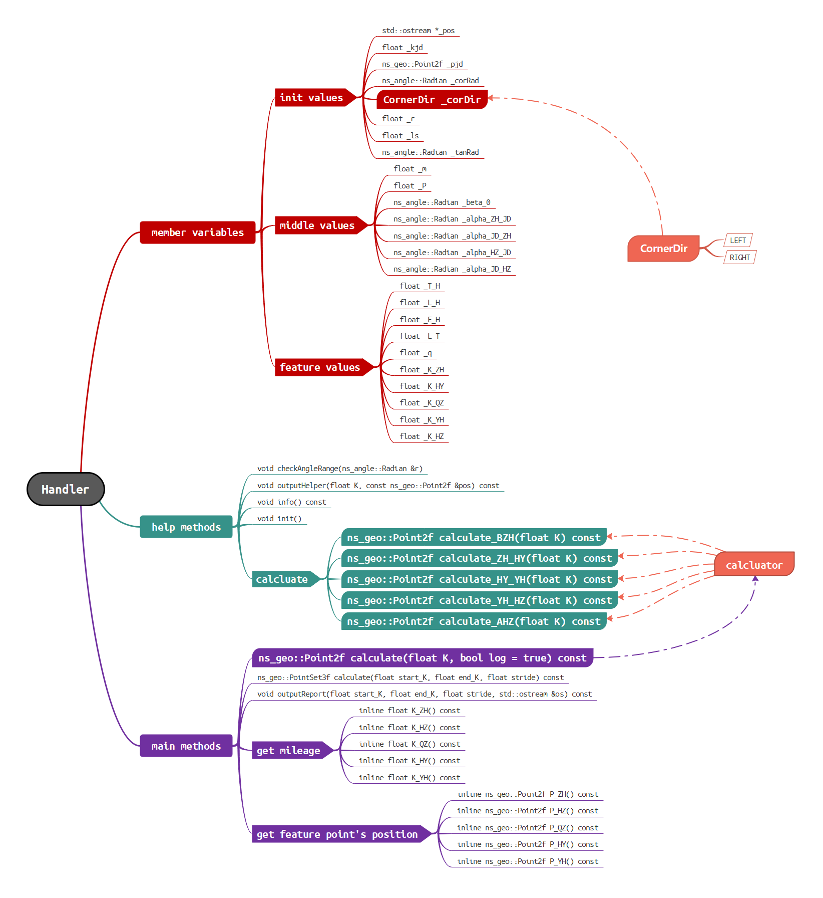
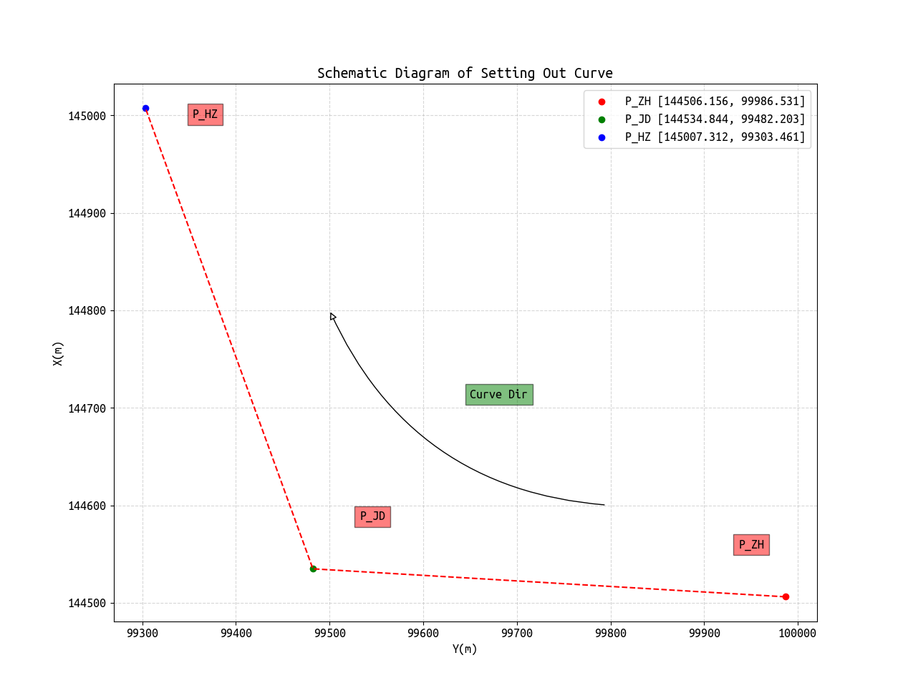
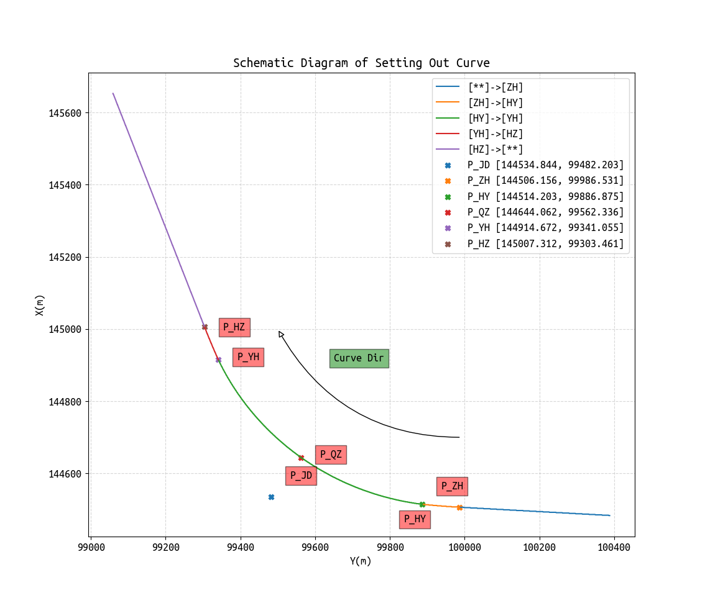

# Curve Calculator
>___Authors : csl___   
>___E-Mail : 3079625093@qq.com___

## Describe
The program of curve lofting realizes the compilation of QT interface, and has applicability. The preparation of this project is divided into back-end library preparation and front-end interface preparation, both of which are developed serially.

## Images and Videos
<video id="video" controls="" preload="none">
    <source id="mp4" src="./imgs/qcurve.mp4" type="video/mp4">
</video>

