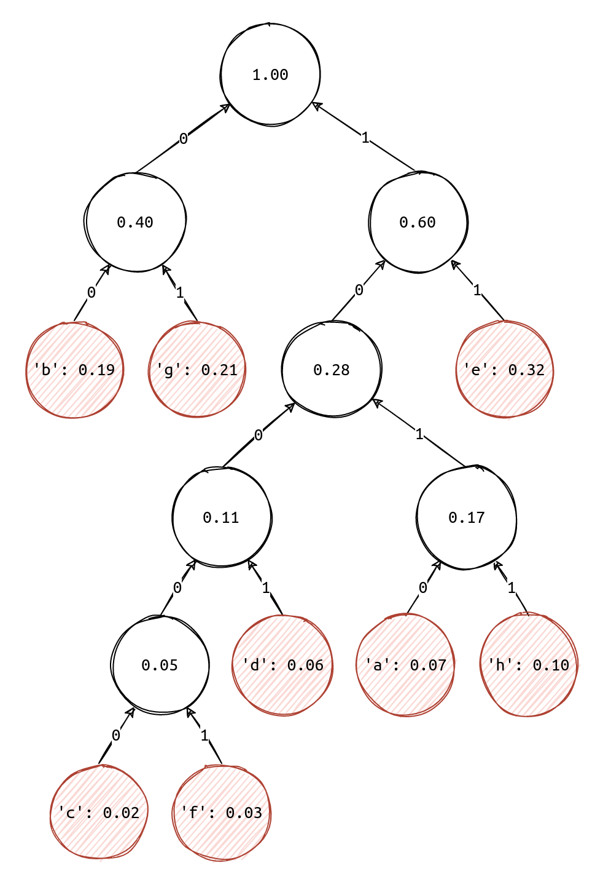
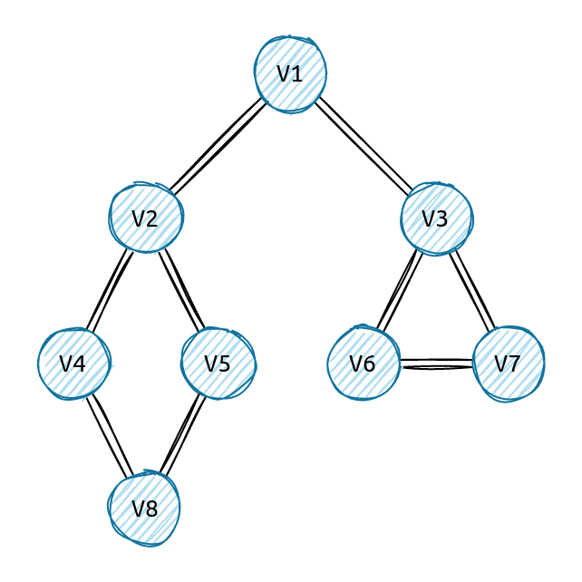

# 数据结构-课程实习

[TOC]

## 一、说明

本项目为遥感学院《数据结构》课程实习。本项目使用的是___C++___语言，使用了面向对象的模式进行代码的编写。

本次实习一共包含四部分内容：

+ 线性链表及其相关操作的实现 [linklist.cpp](./src/linklist/)
+ 循环队列及其相关操作的实现 [cirqueue](./src/cirqueue/)
+ 哈夫曼树的生成 [hfmtree](./src/hfmtree/)
+ 图的深度优先遍历 [graph](./src/graph/)

## 二、文件结构

```cpp
.
├── build 编译文件夹
├── img 图片文件夹
├── readme.md 
└── src 源码文件夹
    ├── cirqueue 循环队列源码
    ├── graph 图源码
    ├── hfmtree 哈夫曼树源码
    └── linklist 线性链表源码
```


## 三、测试

### 1. 线性链表

测试代码

```cpp
int main(int argc, char const *argv[]) {
  try {
    int array[] = {1, 2, 3, 4};
    // 构造一个含有四个元素的链表
    ns_db::LinkList ls(array, 4);
      
    // 打印链表
    ls.traverse(print);
    std::cout << std::endl;

    int elem;
    // 将链表下标为"3"的元素删除(下标从"0"开始), 并打印链表
    ls.erase(elem, 3).traverse(print);
    std::cout << std::endl;
      
    // 先后在链表的两个位置插入两个元素, 并打印链表
    ls.insert(12, 2).insert(34, 0).traverse(print);
    std::cout << std::endl;

  } catch (const std::exception &e) {
    std::cerr << e.what() << '\n';
  }
  return 0;
}
```

程序输出

```cpp
// 输出结果, 其中'node-deconstructor'表示节点被删除, 内存被释放
1 2 3 4 
'node-deconstructor'
1 2 3 
34 1 2 12 3 
'node-deconstructor'
'node-deconstructor'
'node-deconstructor'
'node-deconstructor'
'node-deconstructor'
'node-deconstructor'
```

### 3. 循环队列

测试代码

```cpp
int main(int argc, char const *argv[]) {
  try {
    // 构造最大长度为4的队列
    ns_db::CirQueue cq(4);
    // 4个元素依次入队, 并遍历输出队列
    cq.push(12).push(23).push(34).push(13).traverse(print);
    std::cout << std::endl;
    // 输出该队列的状态信息
    std::cout << cq << std::endl
              << std::endl;

    int top;
    // 元素出队
    cq.pop(top).traverse(print);
    std::cout << "the top elem is: " << top << std::endl;
    // 输出该队列的状态信息
    std::cout << cq << std::endl
              << std::endl;

    cq.push(43);
    cq.traverse(print);
    // 输出该队列的状态信息
    std::cout << cq << std::endl;
    std::cout << std::endl
              << std::endl;

    // 元素出队
    cq.pop(top);
    std::cout << "the top elem is: " << top << std::endl;
    cq.traverse(print);
    // 输出该队列的状态信息
    std::cout << cq << std::endl;
    std::cout << std::endl
              << std::endl;

  } catch (const std::exception &e) {
    std::cerr << e.what() << '\n';
  }
  return 0;
}
```

程序输出

```cpp
12 23 34 13 
{'maxSize': 5, 'enableSize': 4, 'front': 0, 'rear': 4}

23 34 13 the top elem is: 12
{'maxSize': 5, 'enableSize': 4, 'front': 1, 'rear': 4}

23 34 13 43 {'maxSize': 5, 'enableSize': 4, 'front': 1, 'rear': 0}


the top elem is: 23
34 13 43 {'maxSize': 5, 'enableSize': 4, 'front': 2, 'rear': 0}
```

### 3. 哈夫曼树



测试代码

```cpp
int main(int argc, char const *argv[]) {
  try {
    /**
     * {a, b, c, d, e, f, g, h}
     * {0.07, 0.19, 0.02, 0.06, 0.32, 0.03, 0.21, 0.10}
     */
    ns_db::Node nodes[] = {
        ns_db::Node('a', 0.07f), ns_db::Node('b', 0.19f), ns_db::Node('c', 0.02f), ns_db::Node('d', 0.06f),
        ns_db::Node('e', 0.32f), ns_db::Node('f', 0.03f), ns_db::Node('g', 0.21f), ns_db::Node('h', 0.10f)};
    // 构建哈夫曼数
    ns_db::HFMTree hfmt(nodes, 8);
    // 输出哈夫曼树的内部构造数据
    std::cout << hfmt << std::endl;
    // 打印最后的哈夫曼编码
    hfmt.printHFMCode();

  } catch (const std::exception &e) {
    std::cerr << e.what() << '\n';
  }

  return 0;
}
```

程序输出

```cpp
0: {'pa': 10, 'lc': -1, 'rc': -1, 'w': 0.07}
1: {'pa': 12, 'lc': -1, 'rc': -1, 'w': 0.19}
2: {'pa': 8, 'lc': -1, 'rc': -1, 'w': 0.02}
3: {'pa': 9, 'lc': -1, 'rc': -1, 'w': 0.06}
4: {'pa': 13, 'lc': -1, 'rc': -1, 'w': 0.32}
5: {'pa': 8, 'lc': -1, 'rc': -1, 'w': 0.03}
6: {'pa': 12, 'lc': -1, 'rc': -1, 'w': 0.21}
7: {'pa': 10, 'lc': -1, 'rc': -1, 'w': 0.1}
8: {'pa': 9, 'lc': 2, 'rc': 5, 'w': 0.05}
9: {'pa': 11, 'lc': 8, 'rc': 3, 'w': 0.11}
10: {'pa': 11, 'lc': 0, 'rc': 7, 'w': 0.17}
11: {'pa': 13, 'lc': 9, 'rc': 10, 'w': 0.28}
12: {'pa': 14, 'lc': 1, 'rc': 6, 'w': 0.4}
13: {'pa': 14, 'lc': 11, 'rc': 4, 'w': 0.6}
14: {'pa': -1, 'lc': 12, 'rc': 13, 'w': 1}

'a': 1010
'b': 00
'c': 10000
'd': 1001
'e': 11
'f': 10001
'g': 01
'h': 1011
```

### 4. 图



测试代码

```cpp
int main(int argc, char const *argv[]) {
  ns_db::UDGraphInfo info[] = {
      ns_db::UDGraphInfo('1', '2'),
      ns_db::UDGraphInfo('1', '3'),
      ns_db::UDGraphInfo('2', '4'),
      ns_db::UDGraphInfo('2', '5'),
      ns_db::UDGraphInfo('4', '8'),
      ns_db::UDGraphInfo('5', '8'),
      ns_db::UDGraphInfo('3', '6'),
      ns_db::UDGraphInfo('3', '7'),
      ns_db::UDGraphInfo('6', '7')};
    
  ns_db::UDGraph graph(info, 9);
  std::cout << graph << std::endl;
    
  graph.traverseDFS(print);
  std::cout << std::endl;

  return 0;
}
```

程序输出

```cpp
{'pos': 0, 'symbol': 1, 'links': [(1)-(2)-]}
{'pos': 1, 'symbol': 2, 'links': [(0)-(3)-(4)-]}
{'pos': 2, 'symbol': 3, 'links': [(0)-(6)-(7)-]}
{'pos': 3, 'symbol': 4, 'links': [(1)-(5)-]}
{'pos': 4, 'symbol': 5, 'links': [(1)-(5)-]}
{'pos': 5, 'symbol': 8, 'links': [(3)-(4)-]}
{'pos': 6, 'symbol': 6, 'links': [(2)-(7)-]}
{'pos': 7, 'symbol': 7, 'links': [(2)-(6)-]}

1 2 4 8 5 3 6 7 
```

