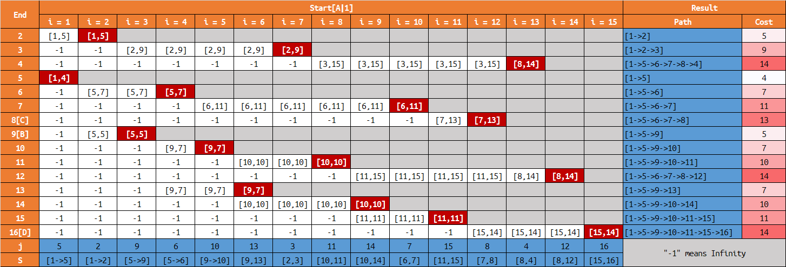
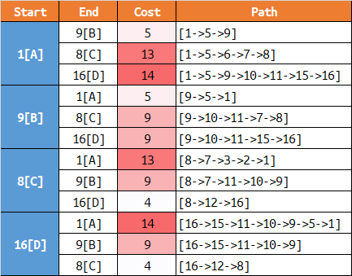
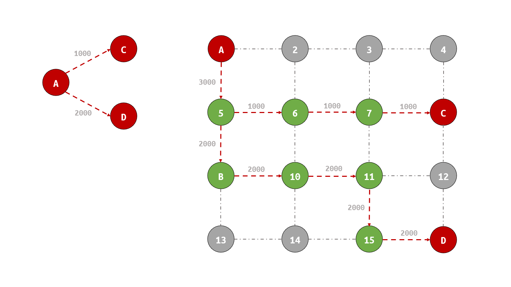
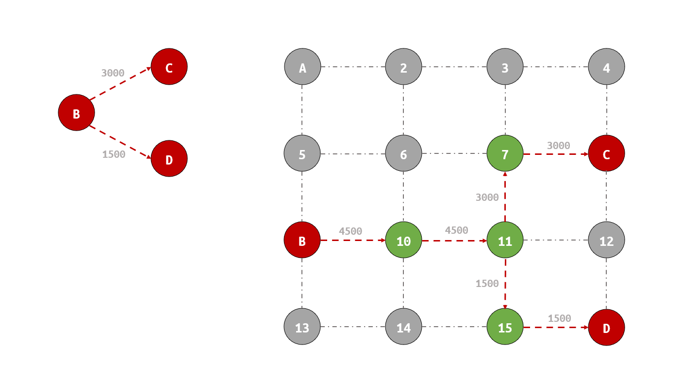

# __Dijkstra Algorithm : Find the 'Shortest' Way__

>__Author : csl__   
>__E-Mail : 3079625093@qq.com__

## Descrieb
Dijkstra algorithm was proposed by Dutch computer scientist Dijkstra in 1959, so it is also called Dijkstra algorithm. It is the shortest path algorithm from one vertex to other vertices, which solves the shortest path problem in weighted graph. The main feature of dijestra algorithm is that it starts from the starting point and adopts the strategy of greedy algorithm. Each time it traverses the adjacent nodes of the vertices closest to the starting point and not visited until it extends to the end point.

## images

