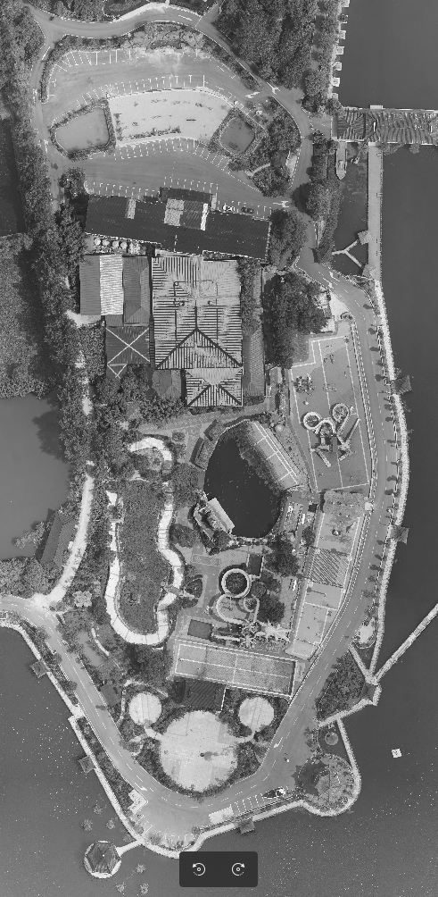
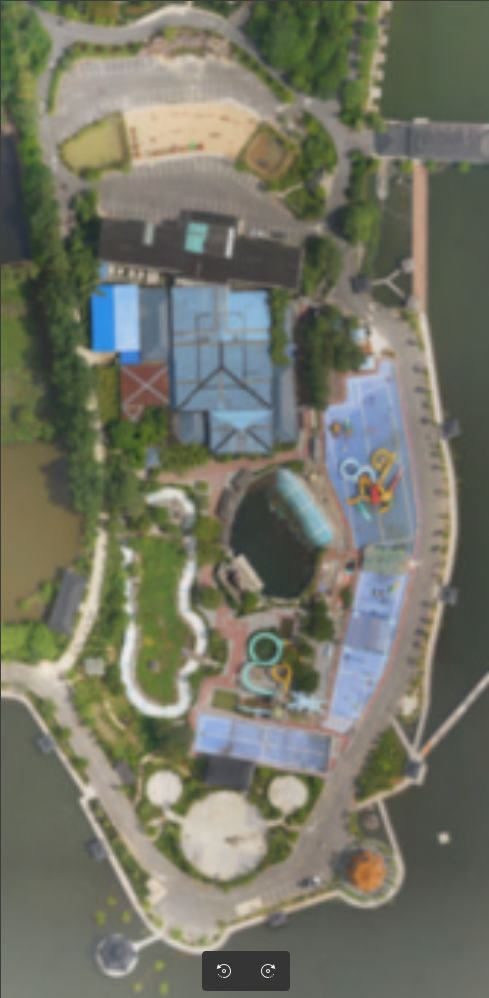
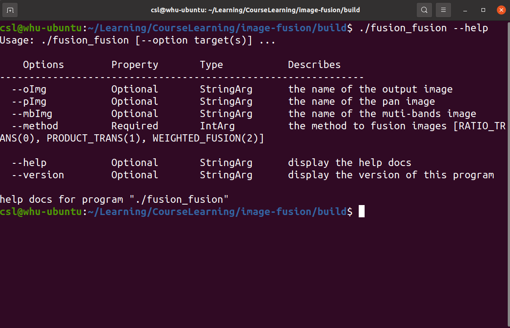
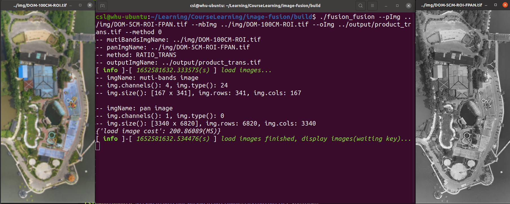
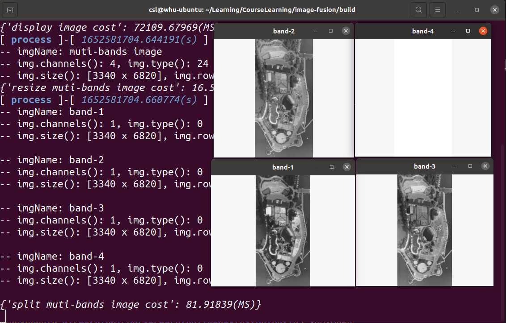
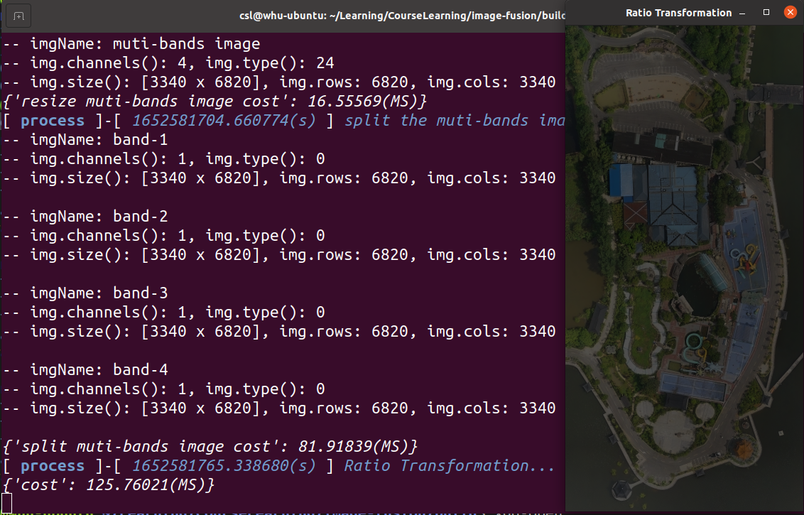
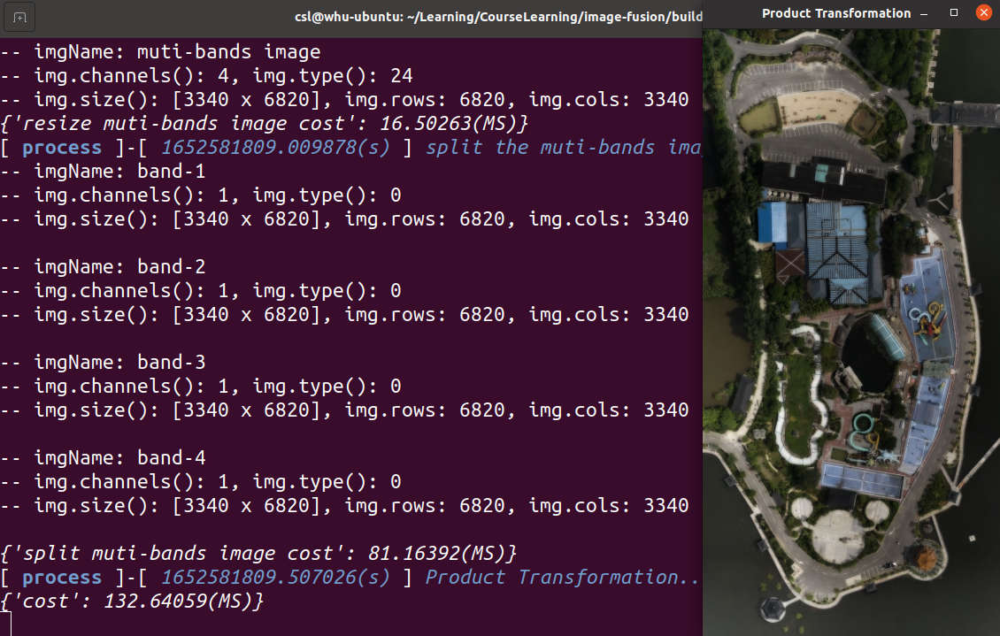
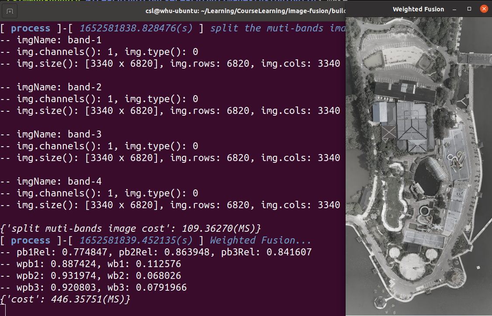
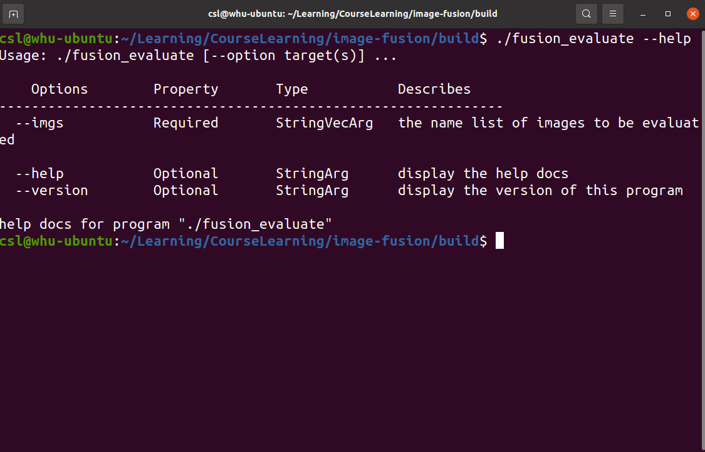
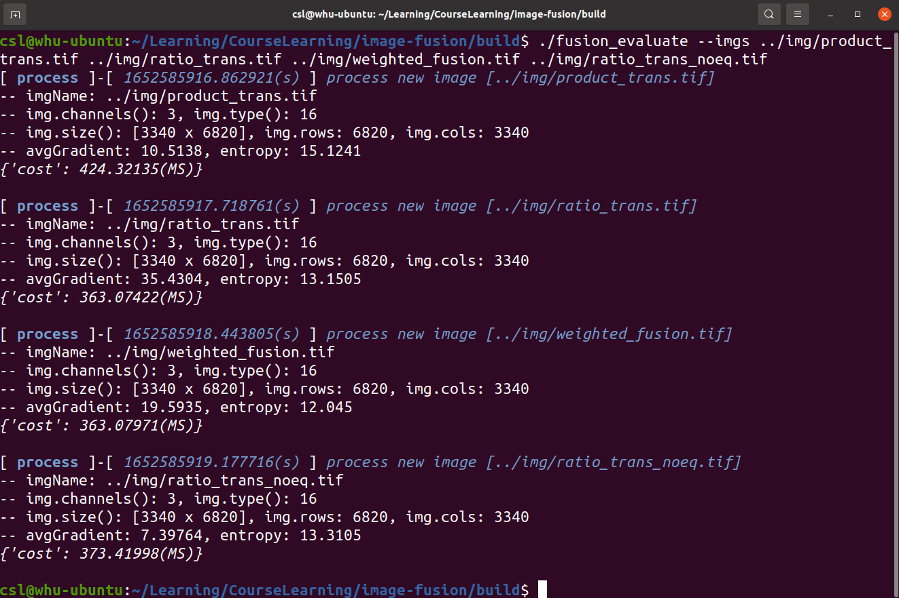

# Muti Source Image Fusion

**Author: shlChen**

**E-Mail: 3079615093@qq.com**

[TOC]

## 1. OverView

Remote sensing image fusion refers to the process of generating new images from multi-source remote sensing images according to certain algorithms under the specified geographical coordinate system. There are three types: pixel based fusion, feature-based fusion and knowledge-based fusion. The three fusion methods in our internship are pixel based fusion, which is relatively simple.

## 2. Source Data



## 3. RunTime

### 1) Fusion













### 2) Evaluate





## 4. Logs

### 1) Fusion

**ratio_trans**

```apl
csl@whu-ubuntu:~/Learning/CourseLearning/image-fusion/build$ ./fusion --method 0 --oImg ../img/ratio_trans.tif
-- mutiBandsImgName: ../img/DOM-100CM-ROI.tif
-- panImgName: ../img/DOM-5CM-ROI-FPAN.tif
-- method: RATIO_TRANS
-- outputImgName: ../img/ratio_trans.tif
[ info ]-[ 1652533936.245665(s) ] load images...
-- imgName: muti-bands image
-- img.channels(): 4, img.type(): 24
-- img.size(): [167 x 341], img.rows: 341, img.cols: 167

-- imgName: pan image
-- img.channels(): 1, img.type(): 0
-- img.size(): [3340 x 6820], img.rows: 6820, img.cols: 3340
{'load image cost': 204.14775(MS)}
[ info ]-[ 1652533936.449849(s) ] load images finished, display images(waiting key)...
{'display image cost': 1736.53577(MS)}
[ process ]-[ 1652533938.186437(s) ] resize the muti-bands image...
-- imgName: muti-bands image
-- img.channels(): 4, img.type(): 24
-- img.size(): [3340 x 6820], img.rows: 6820, img.cols: 3340
{'resize muti-bands image cost': 14.44334(MS)}
[ process ]-[ 1652533938.200914(s) ] split the muti-bands image...
-- imgName: band-1
-- img.channels(): 1, img.type(): 0
-- img.size(): [3340 x 6820], img.rows: 6820, img.cols: 3340

-- imgName: band-2
-- img.channels(): 1, img.type(): 0
-- img.size(): [3340 x 6820], img.rows: 6820, img.cols: 3340

-- imgName: band-3
-- img.channels(): 1, img.type(): 0
-- img.size(): [3340 x 6820], img.rows: 6820, img.cols: 3340

-- imgName: band-4
-- img.channels(): 1, img.type(): 0
-- img.size(): [3340 x 6820], img.rows: 6820, img.cols: 3340

{'split muti-bands image cost': 88.90137(MS)}
[ process ]-[ 1652533939.090645(s) ] Ratio Transformation...
{'cost': 120.04105(MS)}
[ info ]-[ 1652533940.096191(s) ] writing image
{'cost': 805.87939(MS)}
```


**product_trans**

```apl
csl@whu-ubuntu:~/Learning/CourseLearning/image-fusion/build$ ./fusion --method 1 --oImg ../img/product_trans.tif
-- mutiBandsImgName: ../img/DOM-100CM-ROI.tif
-- panImgName: ../img/DOM-5CM-ROI-FPAN.tif
-- method: PRODUCT_TRANS
-- outputImgName: ../img/product_trans.tif
[ info ]-[ 1652533994.309405(s) ] load images...
-- imgName: muti-bands image
-- img.channels(): 4, img.type(): 24
-- img.size(): [167 x 341], img.rows: 341, img.cols: 167

-- imgName: pan image
-- img.channels(): 1, img.type(): 0
-- img.size(): [3340 x 6820], img.rows: 6820, img.cols: 3340
{'load image cost': 210.52808(MS)}
[ info ]-[ 1652533994.519983(s) ] load images finished, display images(waiting key)...
{'display image cost': 837.32971(MS)}
[ process ]-[ 1652533995.357350(s) ] resize the muti-bands image...
-- imgName: muti-bands image
-- img.channels(): 4, img.type(): 24
-- img.size(): [3340 x 6820], img.rows: 6820, img.cols: 3340
{'resize muti-bands image cost': 15.56476(MS)}
[ process ]-[ 1652533995.372952(s) ] split the muti-bands image...
-- imgName: band-1
-- img.channels(): 1, img.type(): 0
-- img.size(): [3340 x 6820], img.rows: 6820, img.cols: 3340

-- imgName: band-2
-- img.channels(): 1, img.type(): 0
-- img.size(): [3340 x 6820], img.rows: 6820, img.cols: 3340

-- imgName: band-3
-- img.channels(): 1, img.type(): 0
-- img.size(): [3340 x 6820], img.rows: 6820, img.cols: 3340

-- imgName: band-4
-- img.channels(): 1, img.type(): 0
-- img.size(): [3340 x 6820], img.rows: 6820, img.cols: 3340

{'split muti-bands image cost': 90.18242(MS)}
[ process ]-[ 1652533996.137386(s) ] Product Transformation...
{'cost': 154.70561(MS)}
[ info ]-[ 1652533997.170499(s) ] writing image
{'cost': 850.31714(MS)}
```

**weighted_fusion**

```apl
csl@whu-ubuntu:~/Learning/CourseLearning/image-fusion/build$ ./fusion --method 2 --oImg ../img/weighted_fusion.tif
-- mutiBandsImgName: ../img/DOM-100CM-ROI.tif
-- panImgName: ../img/DOM-5CM-ROI-FPAN.tif
-- method: WEIGHT_FUSION
-- outputImgName: ../img/weighted_fusion.tif
[ info ]-[ 1652534057.780962(s) ] load images...
-- imgName: muti-bands image
-- img.channels(): 4, img.type(): 24
-- img.size(): [167 x 341], img.rows: 341, img.cols: 167

-- imgName: pan image
-- img.channels(): 1, img.type(): 0
-- img.size(): [3340 x 6820], img.rows: 6820, img.cols: 3340
{'load image cost': 211.08371(MS)}
[ info ]-[ 1652534057.992078(s) ] load images finished, display images(waiting key)...
{'display image cost': 596.15552(MS)}
[ process ]-[ 1652534058.588286(s) ] resize the muti-bands image...
-- imgName: muti-bands image
-- img.channels(): 4, img.type(): 24
-- img.size(): [3340 x 6820], img.rows: 6820, img.cols: 3340
{'resize muti-bands image cost': 16.18046(MS)}
[ process ]-[ 1652534058.604492(s) ] split the muti-bands image...
-- imgName: band-1
-- img.channels(): 1, img.type(): 0
-- img.size(): [3340 x 6820], img.rows: 6820, img.cols: 3340

-- imgName: band-2
-- img.channels(): 1, img.type(): 0
-- img.size(): [3340 x 6820], img.rows: 6820, img.cols: 3340

-- imgName: band-3
-- img.channels(): 1, img.type(): 0
-- img.size(): [3340 x 6820], img.rows: 6820, img.cols: 3340

-- imgName: band-4
-- img.channels(): 1, img.type(): 0
-- img.size(): [3340 x 6820], img.rows: 6820, img.cols: 3340

{'split muti-bands image cost': 90.24012(MS)}
[ process ]-[ 1652534059.402973(s) ] Weighted Fusion...
-- pb1Rel: 0.774847, pb2Rel: 0.863948, pb3Rel: 0.841607
-- wpb1: 0.887424, wb1: 0.112576
-- wpb2: 0.931974, wb2: 0.068026
-- wpb3: 0.920803, wb3: 0.0791966
{'cost': 481.78882(MS)}
[ info ]-[ 1652534060.618222(s) ] writing image
{'cost': 877.54846(MS)}
```

### 2) Evaluate

```apl
csl@whu-ubuntu:~/Learning/CourseLearning/image-fusion/build$ ./fusion_evaluate --imgs ../img/product_trans.tif ../img/ratio_trans.tif ../img/weighted_fusion.tif 
[ process ]-[ 1652581320.841077(s) ] process new image [../img/product_trans.tif]
-- imgName: ../img/product_trans.tif
-- img.channels(): 3, img.type(): 16
-- img.size(): [3340 x 6820], img.rows: 6820, img.cols: 3340
-- avgGradient: 10.5138, entropy: 15.1195
{'cost': 412.45740(MS)}

[ process ]-[ 1652581321.624930(s) ] process new image [../img/ratio_trans.tif]
-- imgName: ../img/ratio_trans.tif
-- img.channels(): 3, img.type(): 16
-- img.size(): [3340 x 6820], img.rows: 6820, img.cols: 3340
-- avgGradient: 7.39764, entropy: 13.3064
{'cost': 362.00037(MS)}

[ process ]-[ 1652581322.357218(s) ] process new image [../img/weighted_fusion.tif]
-- imgName: ../img/weighted_fusion.tif
-- img.channels(): 3, img.type(): 16
-- img.size(): [3340 x 6820], img.rows: 6820, img.cols: 3340
-- avgGradient: 19.5935, entropy: 12.0411
{'cost': 386.94882(MS)}
```


