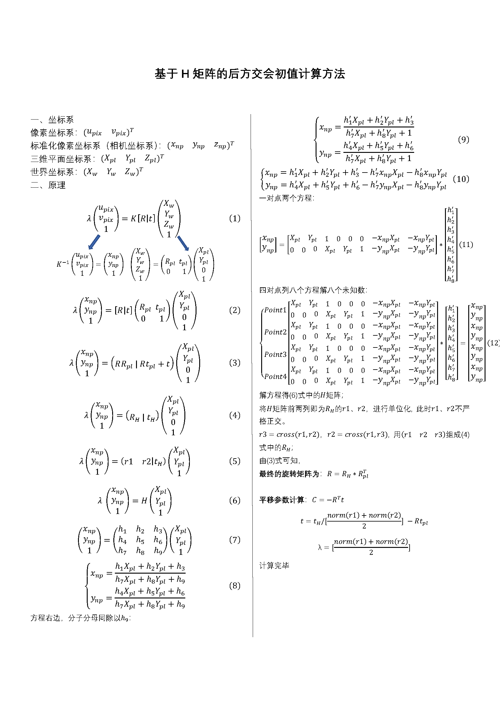
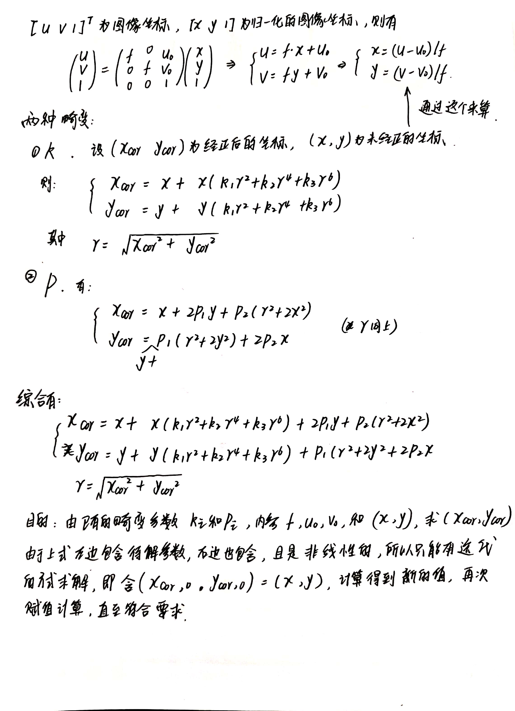
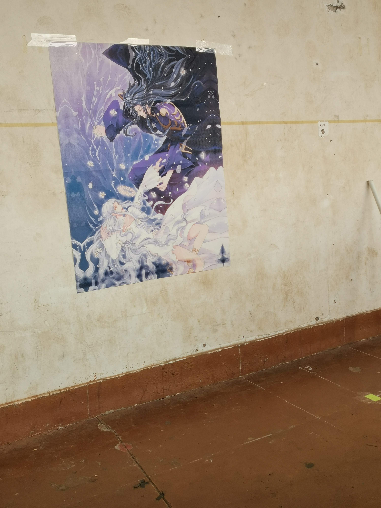
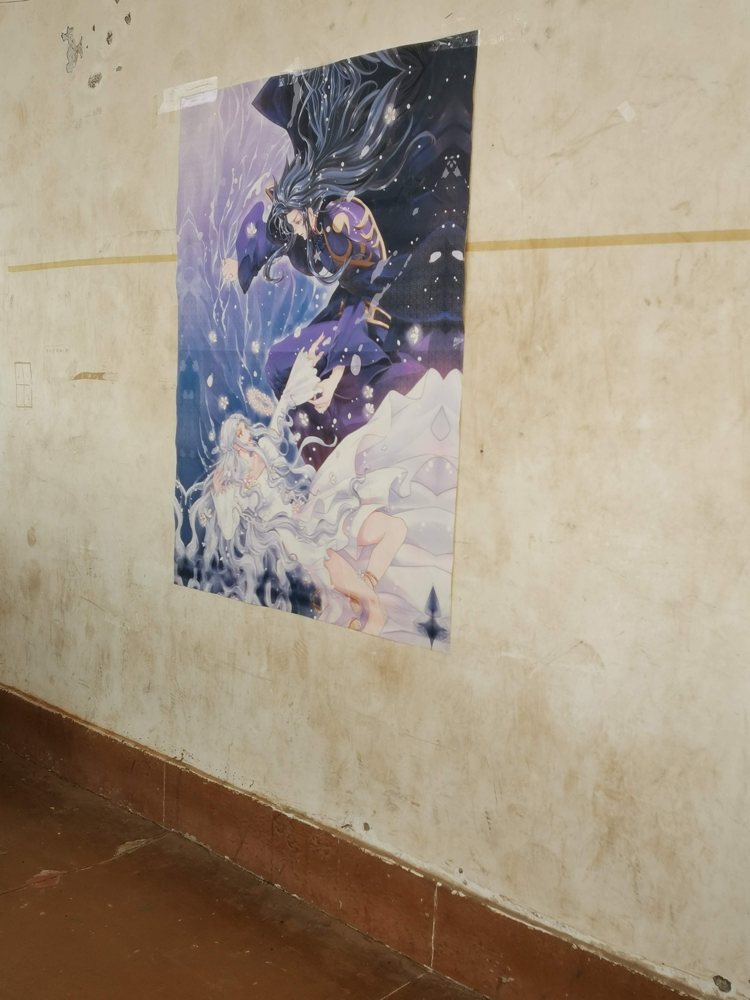
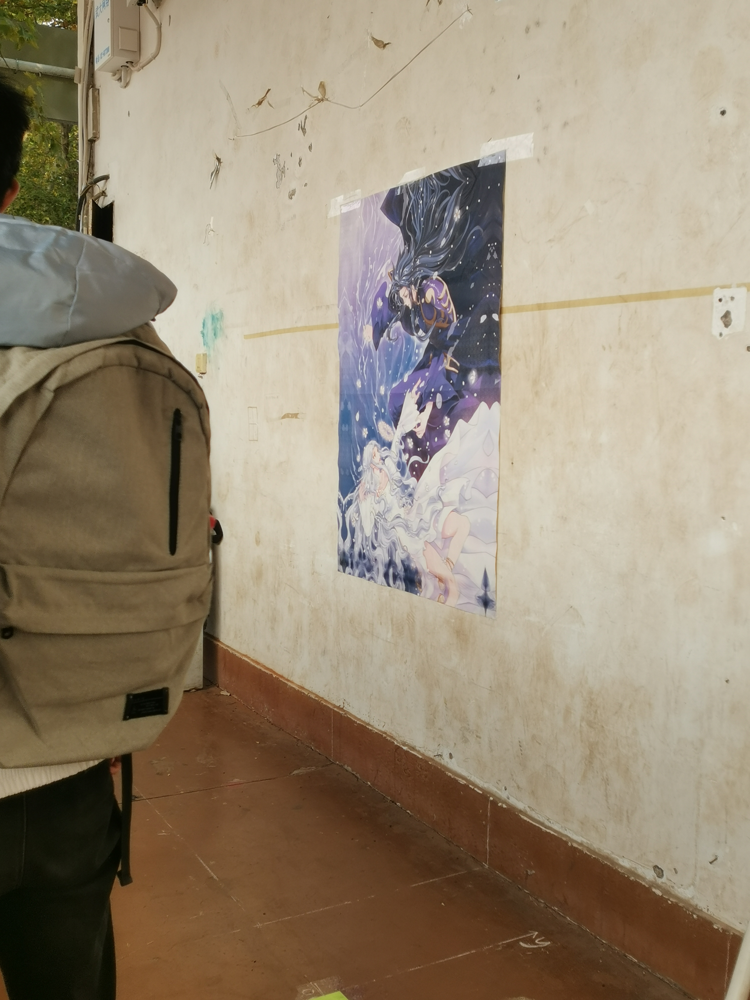
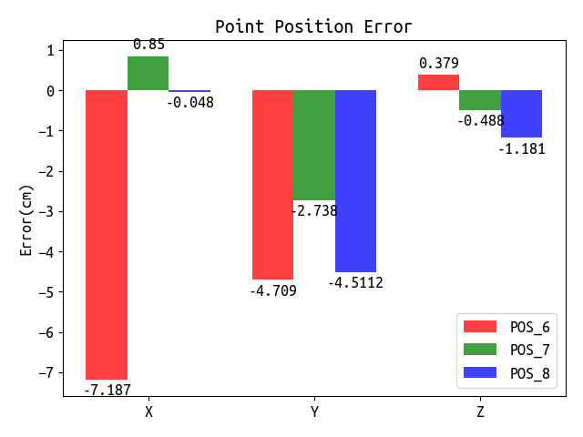
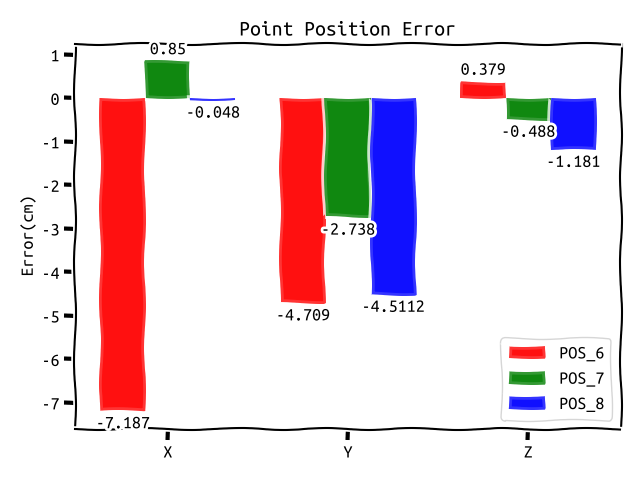
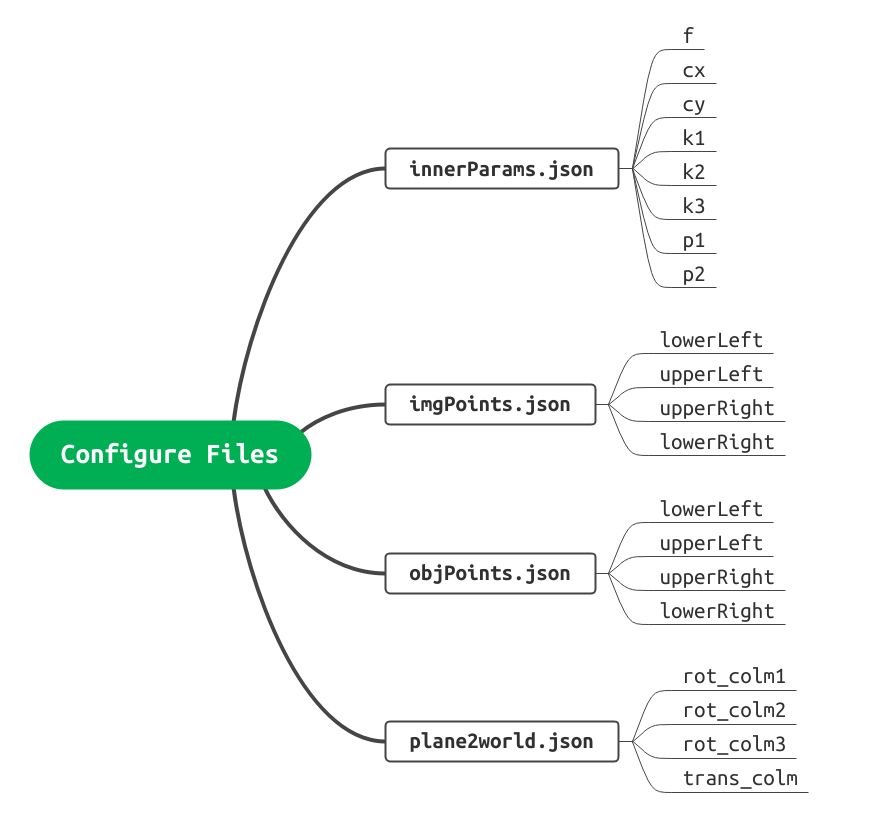
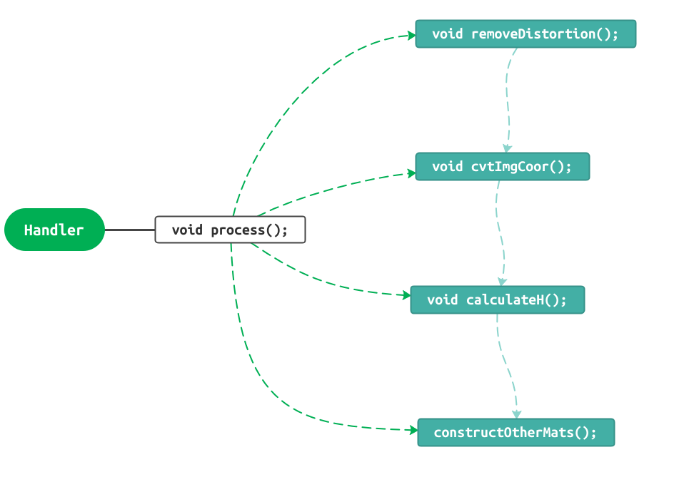
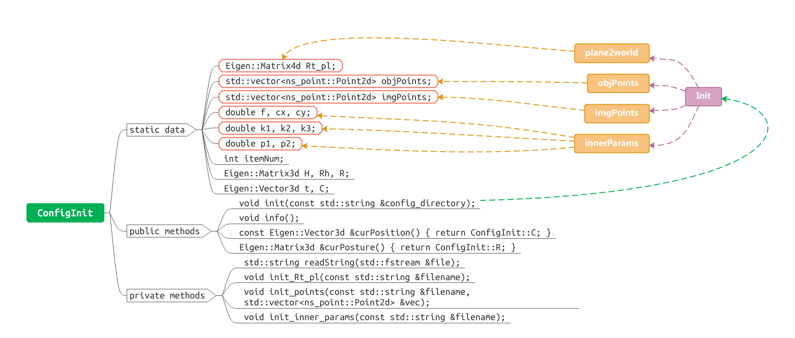

# Resection for Indoor
>___Author : csl___   
>___E-Mail : 3079625093@qq.com___
---
## ___Overview___

### Based on the spatial resection theory, the algorithm solves the camera position by solving the homography matrix.
---

## ThridParty

>___ceres___    
>___point(self-build)___

## Algorithm and Image



## Result
>___point errors___



## System




## Usgae
```cpp
int main(int argc, char const *argv[])
{
    // load the directory og the configure files and read the info
    ns_res::ConfigInit::init("../configs");
    // output the info
    ns_res::ConfigInit::info();
    // calculate the pos
    ns_res::Handler::process();
    return 0;
}
```

## ___Output___
```cpp
----------------------
Rt[plane2world] matrix
----------------------
     1      0      0 -129.5
     0      0     -1     69
     0      1      0   67.5
     0      0      0      1
------------
image points
------------
[606,2311],[375,326],[1695,378],[1816,2094],
-------------
object points
-------------
[0,0],[0,123.8],[93.5,123.8],[93.5,0],
------------
inner params
------------
 f : 4337.78
cx : 1525.38
cy : 1988.29
k1 : 0.0992913
k2 : -0.372798
k3 : 0.337045
p1 : 0.000230373
p2 : -0.000204854
-----------------
remove distortion
----------------------------
Convert to image coordinates
----------------------
calculate the H matrix
----------------------
  0.00308471 -0.000281176    -0.211092
-0.000490183   -0.0034722     0.073993
  0.00165683 -0.000524737            1
--------------------
construct other mats
--------------------
Rh mat[R * R_pl]
----------------
   0.87246 -0.0773821    0.48252
  -0.13864  -0.986008  0.0925533
  0.468606  -0.147646  -0.870982
----------------------
R mat[Rh * R_pl.inv()]
----------------------
   0.87246   -0.48252 -0.0773821
  -0.13864 -0.0925533  -0.986008
  0.468606   0.870982  -0.147646
-----------------------------------------------
t mat[translate from plane Coor to camera Coor]
-----------------------------------------------
-207.187
-204.709
 125.379
```

### ___Configure Files___
>___imgPoints.json___

```cpp
{
    "lowerLeft": [
        606,
        2311
    ],
    "upperLeft": [
        375,
        326
    ],
    "upperRight": [
        1695,
        378
    ],
    "lowerRight": [
        1816,
        2094
    ]
}
```

>___innerParams.json___

```cpp
{
    "f": 4337.78,
    "cx": 1525.38,
    "cy": 1988.29,
    "k1": 0.0992913,
    "k2": -0.372798,
    "k3": 0.337045,
    "p1": 0.000230373,
    "p2": -0.000204854
}
```
>___objPoints.json___

```cpp
{
    "lowerLeft": [
        0.0,
        0.0
    ],
    "upperLeft": [
        0.0,
        123.8
    ],
    "upperRight": [
        93.5,
        123.8
    ],
    "lowerRight": [
        93.5,
        0.0
    ]
}
```

>___plane2world.json___

```cpp
{
    "rot_colm1": [
        1,
        0,
        0
    ],
    "rot_colm2": [
        0,
        0,
        1
    ],
    "rot_colm3": [
        0,
        -1,
        0
    ],
    "trans_colm": [
        -129.5,
        69.0,
        67.5
    ]
}
```
## project structure
```cpp
.
├── CMakeLists.txt
├── configs
│   ├── imgPoints.json
│   ├── innerParams.json
│   ├── objPoints.json
│   └── plane2world.json
├── docs
│   ├── Algorithm.png
│   ├── calResult.json
│   ├── config.emmx
│   ├── config.png
│   ├── CSL_PHONE
│   │   └── imgs_target
│   │       ├── INNER_PARAMS.json
│   │       ├── POS_6.jpg
│   │       ├── POS_6_PIEXL.json
│   │       ├── POS_7.jpg
│   │       ├── POS_7_PIEXL.json
│   │       ├── POS_8.jpg
│   │       └── POS_8_PIEXL.json
│   ├── handler.png
│   ├── init.png
│   ├── prj_struct.txt
│   ├── removeDistortion.jpg
│   └── system.emmx
├── include
│   ├── configInit.h
│   └── handler.h
├── main.cpp
├── readme.md
├── src
│   ├── configInit.cpp
│   └── handler.cpp
└── thirdparty
    └── include
        └── point.h

8 directories, 28 files
```

## Details

>___ConfigInit___

```cpp
    /**
     * \brief a simple function to print info to the console
     */
    void console(const std::string &str, bool upLine = true, bool downLine = true);

    /**
     * \brief a static class to init the configure files,
     *        it's a part to contain the params.
     */
    class ConfigInit
    {
    private:
        static Eigen::Matrix4d Rt_pl;

        /**
         * \brief point desc
         * [0] lower_left
         * [1] upper_left
         * [2] upper_right
         * [3] lower_right
         */
        static std::vector<ns_point::Point2d> objPoints;
        static std::vector<ns_point::Point2d> imgPoints;

        static double f, cx, cy;
        static double k1, k2, k3;
        static double p1, p2;

        // the num of the points pair
        static int itemNum;

        /**
         * \brief here are the params we need to calculate.
         */
        static Eigen::Matrix3d H;

        static Eigen::Matrix3d Rh;

        static Eigen::Matrix3d R;

        static Eigen::Vector3d t;
        // our pos refering to the world coor
        static Eigen::Vector3d C;

    public:
        static void init(const std::string &config_directory);

        static void info();

        // translate matrix from world coor to camera [or the camera position in the world coor]
        static const Eigen::Vector3d &curPosition() { return ConfigInit::C; }

        // rotation matrix from world coor to camera
        static const Eigen::Vector3d &curposture() { return ConfigInit::R; }

    private:
        ConfigInit() = delete;

        // read all chars in the file
        static std::string readString(std::fstream &file);

        // init the Rt[plane2world] matrix
        static void init_Rt_pl(const std::string &filename);

        // init the point pairs[obj points and img points]
        static void init_points(const std::string &filename, std::vector<ns_point::Point2d> &vec);

        // init the params of f, cx, cy, k[1, 2, 3], p[1, 2]
        static void init_inner_params(const std::string &filename);
    };

```

>___Handler___

```cpp
    /**
     * \brief a ceres struct to calculate the undistortion image point
     */ 
    struct Ceres_RemoveDistortion
    {
        const ns_point::Point2d *_point;
        Ceres_RemoveDistortion(const ns_point::Point2d *point) : _point(point) {}

        bool operator()(const double *const undisPoint, double *out) const;
    };

    /**
     * \brief a ceres struct to calculate the H matrix
     */
    struct Ceres_CalHMatrix
    {
        const ns_point::Point2d *_imgPoint;
        const ns_point::Point2d *_objPoint;

        Ceres_CalHMatrix(const ns_point::Point2d *imgPoint, const ns_point::Point2d *objPoint)
            : _imgPoint(imgPoint), _objPoint(objPoint) {}

        bool operator()(const double *const h, double *out) const;
    };

    class Handler
    {
    public:
        static void process();

    private:
        Handler() = delete;

        // step one : remove distortion
        static void removeDistortion();

        // step two : from pixel to image
        static void cvtImgCoor();

        // step three : calculate H matrix
        static void calculateH();

        // step four : other mats[Rh, R, t, C]
        static void constructOtherMats();
    };
```