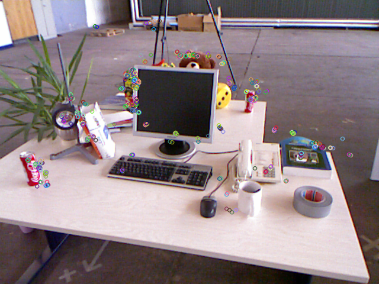
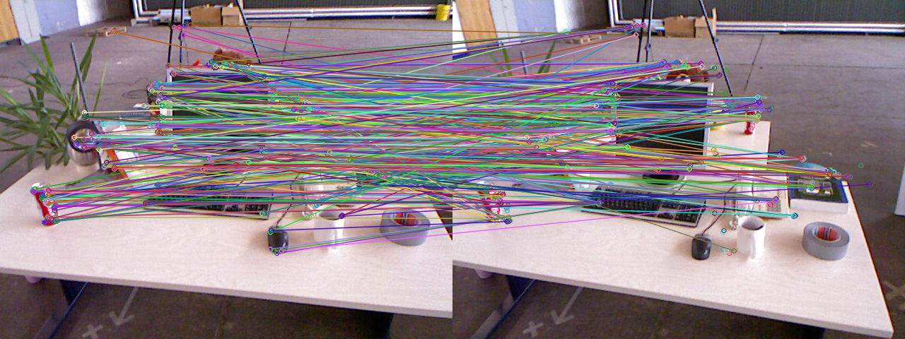
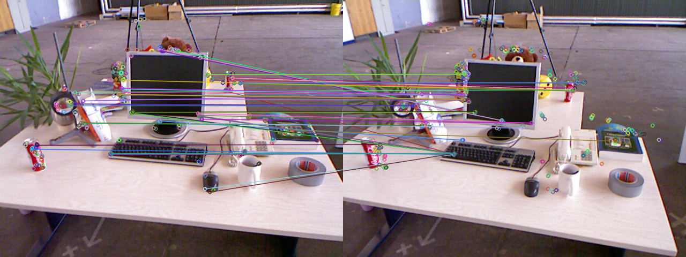

# Chapter-7: Visual Odometry

___Author : csl___

___E-Mail : 3079625093@qq.com___

[TOC]

## 1. Project Tree

```cpp
.
├── build
├── CMakeLists.txt
├── imgs
│   ├── 1.png
│   └── 2.png
├── readme.md
└── src
    └── orb.cpp

12 directories, 36 files
```

## 2. ORB-Feature-Match

### 1. source code

```cpp
void orb() {
  cv::Mat img1 = cv::imread("../imgs/1.png", cv::IMREAD_UNCHANGED);
  cv::Mat img2 = cv::imread("../imgs/2.png", cv::IMREAD_UNCHANGED);

  assert(!img1.empty() && !img2.empty());

  cv::Ptr<cv::FeatureDetector> detector = cv::ORB::create();

  std::vector<cv::KeyPoint> keyPoints1;
  std::vector<cv::KeyPoint> keyPoints2;

  ns_timer::Timer<> timer;
  detector->detect(img1, keyPoints1);
  detector->detect(img1, keyPoints2);
  std::cout << timer.last_elapsed("find key points cost") << std::endl;

  cv::Mat keyPointsMap1, keyPointsMap2;
  cv::drawKeypoints(img1, keyPoints1, keyPointsMap1);
  cv::drawKeypoints(img2, keyPoints2, keyPointsMap2);

  cv::imshow("keyPointsMap1", keyPointsMap1);
  cv::imshow("keyPointsMap2", keyPointsMap2);
  cv::waitKey(0);
  cv::destroyAllWindows();

  cv::Ptr<cv::DescriptorExtractor> descriptor = cv::ORB::create();
  cv::Mat descriptor1, descriptor2;
  timer.reStart();
  descriptor->compute(img1, keyPoints1, descriptor1);
  descriptor->compute(img2, keyPoints2, descriptor2);
  std::cout << timer.last_elapsed("compute discriptor cost") << std::endl;

  std::vector<cv::DMatch> matches;
  cv::Ptr<cv::DescriptorMatcher> matcher =
      cv::DescriptorMatcher::create(cv::DescriptorMatcher::MatcherType::BRUTEFORCE_HAMMING);
  timer.reStart();
  matcher->match(descriptor1, descriptor2, matches);
  std::cout << timer.last_elapsed("match discriptor cost") << std::endl;

  auto minDis = std::min_element(matches.cbegin(), matches.cend(),
                                  [](const cv::DMatch &m1, const cv::DMatch &m2) {
                                    return m1.distance < m2.distance;
                                  })
                    ->distance;

  std::vector<cv::DMatch> goodMatches;
  for (const auto &elem : matches) {
    if (elem.distance <= std::max(2.0f * minDis, 20.0f)) {
      goodMatches.push_back(elem);
    }
  }
  cv::Mat originMatchMap, goodMatchMap;
  cv::drawMatches(img1, keyPoints1, img2, keyPoints2, matches, originMatchMap);
  cv::drawMatches(img1, keyPoints1, img2, keyPoints2, goodMatches, goodMatchMap);

  cv::imshow("originMatchMap", originMatchMap);
  cv::imshow("goodMatches", goodMatchMap);
  cv::waitKey(0);

  std::cout << timer.total_elapsed("total cost") << std::endl;
  return;
}
```

### 2. key points



### 3. matches





### 4. output

```cpp
{find key points cost: 52.396175(ms)}
{compute discriptor cost: 23.071611(ms)}
{match discriptor cost: 1.135137(ms)}
{total cost: 1603.235474(ms)}
```

## 3. CMake

```cmake
cmake_minimum_required(VERSION 3.10)

project(visual_odometry)

set(CMAKE_CXX_STANDARD 17)

find_package(OpenCV)

include_directories(${OpenCV_INCLUDE_DIRS})

link_libraries(${OpenCV_LIBS})

add_executable(${CMAKE_PROJECT_NAME}_orb ${CMAKE_SOURCE_DIR}/src/orb.cpp)
```

